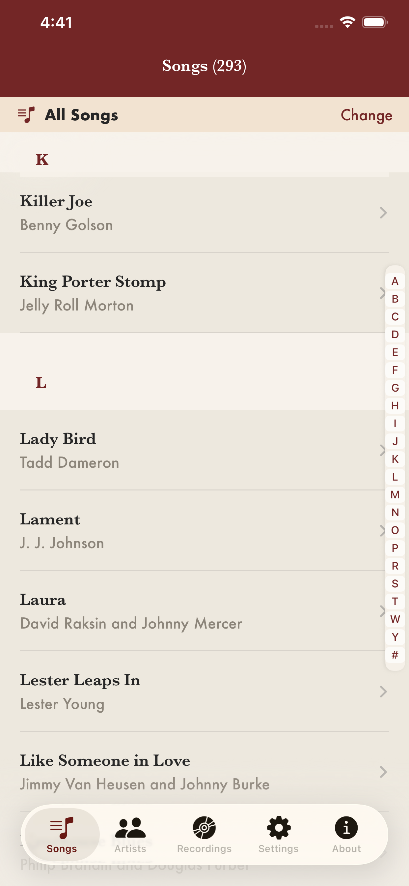
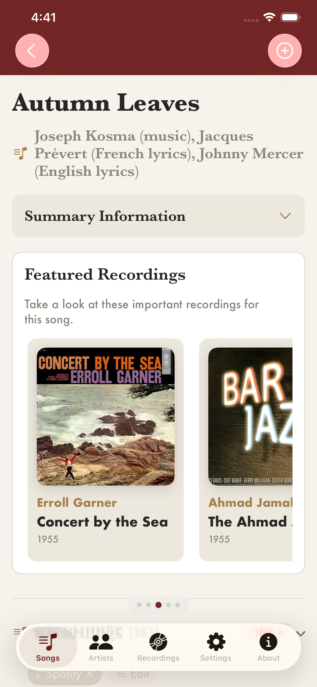
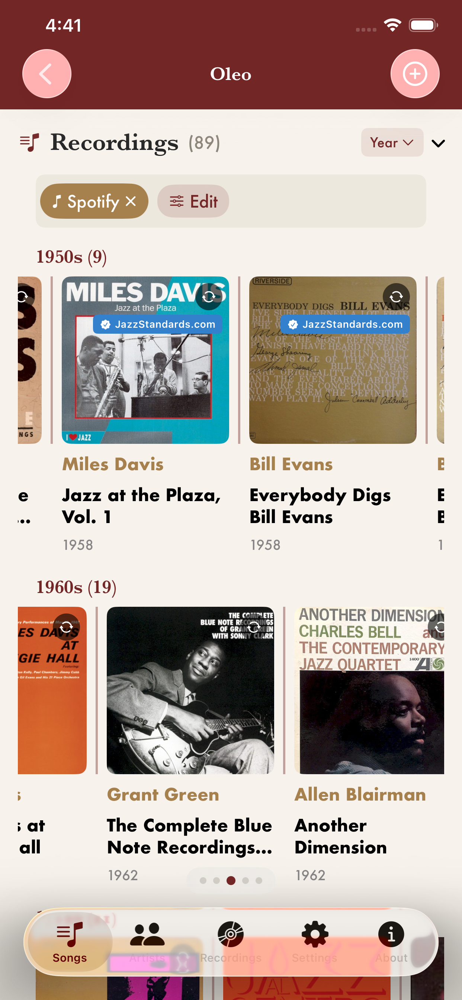
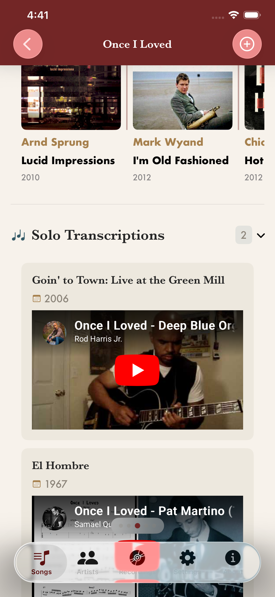
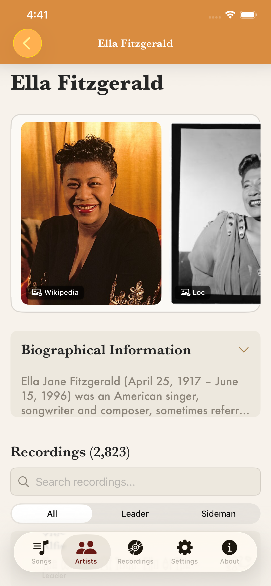

# ApproachNote

A reference app for the study of jazz music. Browse standards, trace recordings across performers and releases, and dig into solo transcriptions — all backed by data enriched from MusicBrainz, Spotify, Apple Music, Cover Art Archive, and Wikipedia.

The public API is deployed at **<https://api.approachnote.com>**.

## Screenshots

| Song list | Song details | Recordings |
|---|---|---|
|  |  |  |

| Transcriptions | Artist |
|---|---|
|  |  |

## Project layout

- **`backend/`** — Flask API (Python 3.13) serving data from PostgreSQL, plus an in-process research worker that enriches songs/recordings from external sources.
- **`apps/`** — SwiftUI clients for iOS and macOS, with shared code under `apps/Shared/`. A `MusicBrainzImporter` share extension is included.
- **`sql/`** — schema and reference data.
- **`doc/`** — design notes, architecture reviews, and operational runbooks.

See [CLAUDE.md](CLAUDE.md) for a more detailed tour of the codebase (blueprint layout, service architecture, data flow, coding conventions).

## Backend setup

```bash
cd backend
python -m venv venv
source venv/bin/activate
pip install -r requirements.txt

# Run locally on port 5001 (also starts the research worker)
python app.py

# Or production-style with gunicorn
gunicorn -c gunicorn.conf.py app:app
```

Create a `.env` in `backend/` with at minimum:

- `DATABASE_URL` — PostgreSQL connection string
- `JWT_SECRET_KEY` — authentication tokens
- `SPOTIFY_CLIENT_ID` / `SPOTIFY_CLIENT_SECRET` — Spotify API
- `SENDGRID_API_KEY` — password reset emails

Optional Apple Music Feed credentials (`APPLE_MEDIA_ID`, `APPLE_PRIVATE_KEY_PATH`, `APPLE_KEY_ID`, `APPLE_TEAM_ID`) enable bulk catalog matching; without them the matcher falls back to the public iTunes Search API. See the "Apple Music Feed" section in [CLAUDE.md](CLAUDE.md) for setup.

## iOS / Mac setup

Open `apps/Approach Note.xcodeproj` in Xcode. The project builds for both iOS and macOS from a shared SwiftUI codebase. By default the apps point at the deployed API — adjust the base URL in `apps/Shared/Services/APIClient.swift` to target a local backend.

## External data sources

- **MusicBrainz** — work IDs, recording metadata, performer credits, releases
- **Spotify** — track matching, album art, streaming links
- **Apple Music** — track matching and album art (Feed API or iTunes Search)
- **Cover Art Archive** — release artwork via MusicBrainz IDs
- **Wikipedia** — artist biographies and song background

## Contributing

Before making changes, read [CLAUDE.md](CLAUDE.md) for codebase conventions — especially the logging rules, services architecture, and the model-update checklist (preview helpers need to be updated alongside model changes).
